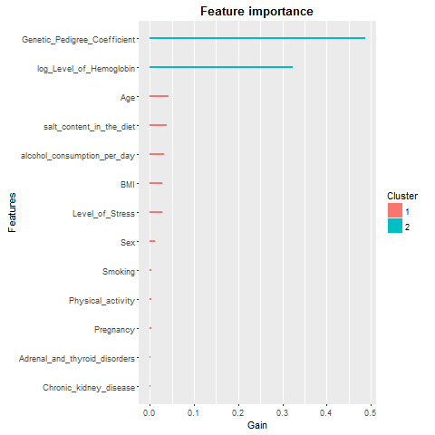

#### Change working directory:
```{r}
setwd("C:/Users/chang_000/Dropbox/Pinsker/CV_Resume/2016JobSearch/Absolutdata/")
```

#### Functions:
```{r}
f_usePackage <- function(p) {
    if (!is.element(p, installed.packages()[,1])) {
        install.packages(p, dep = TRUE);
    }
    require(p, character.only = TRUE);
}
```


#### Load libraries:
```{r, echo=FALSE}
f_usePackage("data.table")
f_usePackage("magrittr")
f_usePackage("dplyr")
f_usePackage("gmodels")
f_usePackage("caret")
f_usePackage("xgboost")
f_usePackage("pROC")
f_usePackage("e1071")
```

#### Load data:
```{r}
df <- fread("Absolutdata_case.csv")

# remove the duplicates if there are any in the data set
df <- df[!duplicated(df), ]

# summary
summary(df)
```

## Data Manipulation ##
```{r}
df$Age_binned <- cut(df$Age, 
                     breaks = c(0, seq(20, 70, 5), Inf), 
                     labels = c("<=20", "21-25", "26-30", "31-35", "36-40", "41-45", "46-50", "51-55", "56-60", "61-65", "66-70", ">70"))
```


## Exploratory Analysis ##
#### Boxplot of Level_of_Hemoglobin by Blood_Pressure_Abnormality:
```{r}
boxplot(Level_of_Hemoglobin ~ Blood_Pressure_Abnormality
        , data = df
        , xlab = "Blood_Pressure_Abnormality"
        , ylab = "Level_of_Hemoglobin")

t.test(subset(df$Level_of_Hemoglobin, df$Blood_Pressure_Abnormality == 0)
       , subset(df$Level_of_Hemoglobin, df$Blood_Pressure_Abnormality == 1))

x <- df$Level_of_Hemoglobin
h <- hist(x, breaks = 10, col = "light blue", xlab = "Level_of_Hemoglobin", main = "Histogram with Normal Curve") 
xfit <- seq(min(x), max(x), length = 40) 
yfit <- dnorm(xfit, mean = mean(x), sd = sd(x)) 
yfit <- yfit * diff(h$mids[1:2]) * length(x) 
lines(xfit, yfit, col = "blue", lwd = 2)
```


#### Boxplot of Genetic_Pedigree_Coefficient by Blood_Pressure_Abnormality
```{r}
boxplot(Genetic_Pedigree_Coefficient ~ Blood_Pressure_Abnormality,data = df, xlab = "Blood_Pressure_Abnormality", ylab = "Genetic_Pedigree_Coefficient")

t.test(subset(df$Genetic_Pedigree_Coefficient, df$Blood_Pressure_Abnormality == 0), subset(df$Genetic_Pedigree_Coefficient, df$Blood_Pressure_Abnormality == 1))

x <- df$Genetic_Pedigree_Coefficient
h <- hist(x, breaks = 10, col = "light blue", xlab = "Level_of_Hemoglobin", main = "Histogram with Normal Curve") 
xfit <- seq(min(x, na.rm=T), max(x, na.rm=T), length = 40) 
yfit <- dnorm(xfit, mean = mean(x, na.rm=T), sd = sd(x, na.rm=T)) 
yfit <- yfit * diff(h$mids[1:2]) * length(x) 
lines(xfit, yfit, col = "blue", lwd = 2)
```


#### Boxplot of Age by Blood_Pressure_Abnormality
```{r}
boxplot(Age ~ Blood_Pressure_Abnormality,data = df, xlab = "Blood_Pressure_Abnormality", ylab = "Age")

t.test(subset(df$Age, df$Blood_Pressure_Abnormality == 0), subset(df$Age, df$Blood_Pressure_Abnormality == 1))

x <- df$Age
h <- hist(x, breaks = 10, col = "light blue", xlab = "Age", main = "Histogram with Normal Curve") 
xfit <- seq(min(x), max(x), length = 40) 
yfit <- dnorm(xfit, mean = mean(x), sd = sd(x)) 
yfit <- yfit * diff(h$mids[1:2]) * length(x) 
lines(xfit, yfit, col = "blue", lwd = 2)
```


#### Boxplot of BMI by Blood_Pressure_Abnormality
```{r}
boxplot(BMI ~ Blood_Pressure_Abnormality,data = df, xlab = "Blood_Pressure_Abnormality", ylab = "BMI")

t.test(subset(df$BMI, df$Blood_Pressure_Abnormality==0), subset(df$BMI, df$Blood_Pressure_Abnormality==1))

x <- df$BMI
h <- hist(x, breaks = 10, col = "light blue", xlab = "BMI", main = "Histogram with Normal Curve") 
xfit <- seq(min(x), max(x), length = 40) 
yfit <- dnorm(xfit, mean = mean(x), sd = sd(x)) 
yfit <- yfit * diff(h$mids[1:2]) * length(x) 
lines(xfit, yfit, col = "blue", lwd = 2)
```


#### boxplot of Physical_activity by Blood_Pressure_Abnormality
```{r}
boxplot(Physical_activity ~ Blood_Pressure_Abnormality,data = df, xlab = "Blood_Pressure_Abnormality", ylab = "Physical_activity")
t.test(subset(df$Physical_activity, df$Blood_Pressure_Abnormality==0), subset(df$Physical_activity, df$Blood_Pressure_Abnormality==1))

x <- df$Physical_activity
h <- hist(x, breaks = 10, col = "light blue", xlab = "Physical_activity", main = "Histogram with Normal Curve") 
xfit <- seq(min(x), max(x), length = 40) 
yfit <- dnorm(xfit, mean = mean(x), sd = sd(x)) 
yfit <- yfit * diff(h$mids[1:2]) * length(x) 
lines(xfit, yfit, col = "blue", lwd = 2)
```


#### Boxplot of salt_content_in_the_diet by Blood_Pressure_Abnormality
```{r}
boxplot(salt_content_in_the_diet ~ Blood_Pressure_Abnormality,data = df, xlab = "Blood_Pressure_Abnormality", ylab = "BMI")
t.test(subset(df$salt_content_in_the_diet, df$Blood_Pressure_Abnormality==0), subset(df$salt_content_in_the_diet, df$Blood_Pressure_Abnormality==1))

x <- df$salt_content_in_the_diet
h <- hist(x, breaks = 10, col = "light blue", xlab = "salt_content_in_the_diet", main = "Histogram with Normal Curve") 
xfit <- seq(min(x), max(x), length = 40) 
yfit <- dnorm(xfit, mean = mean(x), sd = sd(x)) 
yfit <- yfit * diff(h$mids[1:2]) * length(x) 
lines(xfit, yfit, col = "blue", lwd = 2)
```


#### Boxplot of alcohol_consumption_per_day by Blood_Pressure_Abnormality
```{r}
boxplot(alcohol_consumption_per_day ~ Blood_Pressure_Abnormality,data = df, xlab = "Blood_Pressure_Abnormality", ylab = "alcohol_consumption_per_day")
t.test(subset(df$alcohol_consumption_per_day, df$Blood_Pressure_Abnormality==0), subset(df$alcohol_consumption_per_day, df$Blood_Pressure_Abnormality==1))

x <- df$alcohol_consumption_per_day
h <- hist(x, breaks = 10, col = "light blue", xlab = "alcohol_consumption_per_day", main = "Histogram with Normal Curve") 
xfit <- seq(min(x, na.rm=T), max(x, na.rm=T), length = 40) 
yfit <- dnorm(xfit, mean = mean(x, na.rm=T), sd = sd(x, na.rm=T)) 
yfit <- yfit * diff(h$mids[1:2]) * length(x) 
lines(xfit, yfit, col = "blue", lwd = 2)
```


##### Gender
```{r}
mytable <- xtabs( ~ Sex + Blood_Pressure_Abnormality, data=df)
CrossTable(mytable, prop.t = FALSE, prop.r = FALSE, prop.c = TRUE)
summary(mytable) 
```


#### Pregnancy
```{r}
mytable <- xtabs( ~ Pregnancy + Blood_Pressure_Abnormality, data=df)
CrossTable(mytable, prop.t = FALSE, prop.r = FALSE, prop.c = TRUE)
summary(mytable) 
```


#### Smoking
```{r}
mytable <- xtabs( ~ Smoking + Blood_Pressure_Abnormality, data=df)
CrossTable(mytable, prop.t = FALSE, prop.r = FALSE, prop.c = TRUE)
summary(mytable) 

```


#### Level_of_Stress
```{r}
mytable <- xtabs( ~ Level_of_Stress + Blood_Pressure_Abnormality, data=df)
CrossTable(mytable, prop.t = FALSE, prop.r = FALSE, prop.c = TRUE)
summary(mytable) 
```


#### Chronic_kidney_disease
```{r}
mytable <- xtabs( ~ Chronic_kidney_disease + Blood_Pressure_Abnormality, data=df)
CrossTable(mytable, prop.t = FALSE, prop.r = FALSE, prop.c = TRUE)
summary(mytable) 
```


#### Adrenal_and_thyroid_disorders
```{r}
mytable <- xtabs( ~ Adrenal_and_thyroid_disorders + Blood_Pressure_Abnormality, data=df)
CrossTable(mytable, prop.t = FALSE, prop.r = FALSE, prop.c = TRUE)
summary(mytable) 
```


## Methodology ##
### Modeling Methods###
This is a binary classification problem. The potential promising modeling techniques includes logistic regression, regularization (lasso and ridge), ensemble methods (bagging and random forest), GBM, XGB, neural network, support vector machine (SVM), decision tree (DT), and Naive Bayesian. 

Here, I adopted XGB, random forest (rf), and SVM to approach the problem as well as the prediction.

+ XGB: 

*pros* - high accuracy, can handle missing vales, can select different subsets of columns and rows to build the trees, has parallel processing, has build-in CV to tune hyperparameters, has regularization formula to prevent oerfitting, can custom optimization object, and provide variable importance list

*cons* - takes time to train xgb model, 


+ RF: 

*pros* - high accuracy, can handle thousands of variables without variable deletion, give estimates of variable importance in the classification, and run efficiently on large data set 

*cons* - need to take care of missing values


+ SVM:

*pros* - high accuracy, nice theoretical background regarding overfitting, can deal with a problem when the data is not linearly separable by using non-linear kernel function

*cons* - takes time to train a svm model, it is challenging to find proper kernel function to construct  the hyperplan in high dimentional space, can not deal with multi-classification problems (it is a binary classifier)


##### Validation Process
K-fold (K =5) was used train and validate models. Training set (K - 1 folds) was used to train models, followed by prediction on the test set ( on K**th** fold). K-fold cross validation (CV) was also applied to tune hyperparameters of machine learning methods in the training stage.


#### Data Manipulation Process
    + log-transformation on `Level_of_Hemoglobin`
    + Imputation the missing values in `Genetic_Pedigree_Coefficient` and `alcohol_consumption_per_day` using the group medians of the corresponding columns
    + Encode `NA` as `Missing` in Pregnancy 


## Results ##
#### Model Comparison:

      Test AUC:
      XGB       RF        SVM
fold                   
1     0.9388987 0.8283128 0.9133518
2     0.9331225 0.8282894 0.8903975
3     0.9497494 0.8307161 0.9071055
4     0.9281408 0.8111034 0.8886837
5     0.9490415 0.8539378 0.9171503

Overall, XGB had the best prediction ability by having the highest holdout AUCs.

#### Variable Importance




